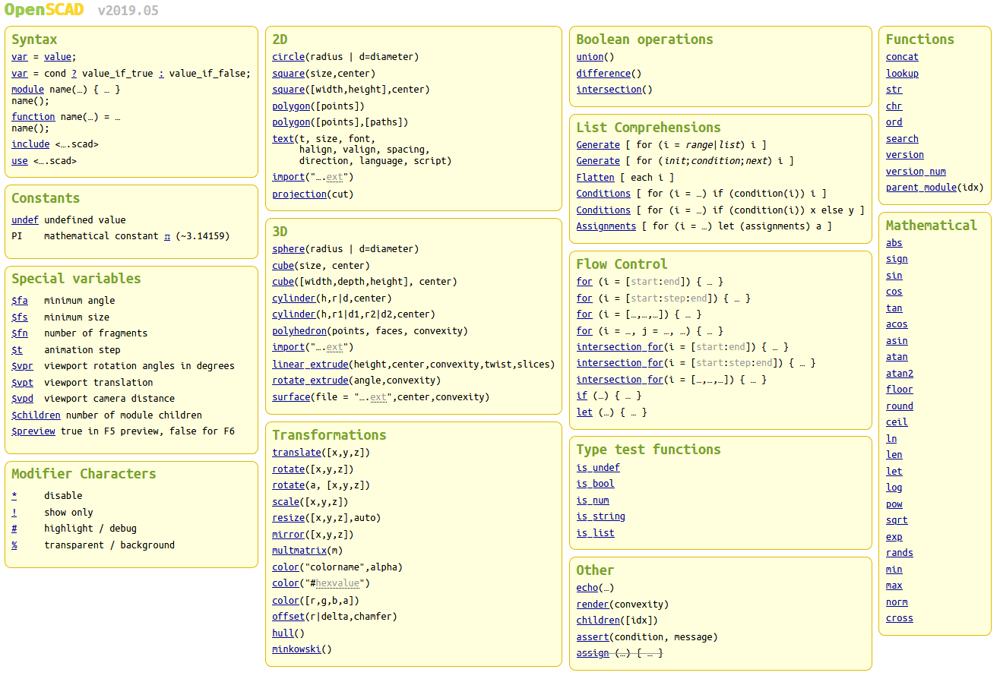

# OpenSCAD guide #

# Table of content

<!-- vim-markdown-toc GFM -->

1. [Models](#models)
	1. [Torus](#torus)
		1. [Version 1](#version-1)
		1. [Version 2](#version-2)
	1. [Triangle](#triangle)
1. [Cheatsheet](#cheatsheet)

<!-- vim-markdown-toc -->

## Models ##
[Table of Content](#table-of-content)

### Torus ###

#### Version 1 ####

Parameters:

* radius of torus circle
* distance between the torus center and the circle center


```openscad
module torus(r_circle = 60, r_to_circle_center = 10, FN = 100)
{
	rotate_extrude(convexity = 10, $fn = FN)
	translate([r_to_circle_center, 0, 0])
	circle(r = r_circle, $fn = FN);
}
```

#### Version 2 ####

Parameters:

* inner radius
* outer radius

```openscad
module torus(r_inner = 50, r_outer = 60, FN = 100)
{
	r_circle = r_outer - r_inner;
	r_to_circle_center = r_circle/2 + r_inner;
	
	rotate_extrude(convexity = 10, $fn = FN)
	translate([r_to_circle_center, 0, 0])
	circle(r = r_circle, $fn = FN);
}
```

### Triangle ###


## Cheatsheet ##
[Table of Content](#table-of-content)

Image from [Cheatsheet site](https://www.openscad.org/cheatsheet/):


