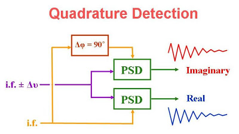
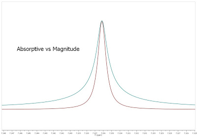

# Quadrature detection #

## Черновик на русском ##

[Источник на русском](https://kubischkin.livejournal.com/117438.html)

[Источник на английском](https://studfile.net/preview/1906607/page:19/)

В одномерном ЯМР квадратурное детектирование сигнала давало ряд довольно милых преемуществ.
Кроме того осуществлялось оно весьма незатейливо.
Для детекции сигнал поступал на receiver, где он разделялся на два потока для конвертирования из радио- в аудио-сигнал.
Из первого потока вычиталась опорная частота (та самая, на которой подавал импульс трансмиттер) в виде cos функции, из второго - опорная частота, сдвинутая по фазе на 90 градусов, соответственно, это sin.
В результате получалось два массива точек, действительные Re и мнимые Im, по TD/2 каждого.
При Фурье-преобразовании комплексные точки преобразовались из временного домена (TD) в домен частотный,
и абсорбционного вида действительный спектр - было то, что экспериментатор видел отображённым на дисплее.

## Преимущества квадратурного детектирования ##

1. При квадратурном детектировании записывается сигнал комплексно, то есть получают частоты опережающие
   и отстающие по сравнению с опорной частотой.
   Поэтому опорная частота помещается в центр спектрального окна.

   В случае сингулярного детектирования опорная частота находится строго на краю спектра.

   Вследствие этого имеем следующие плюсы:

   * эффективное воздействие импульса на сигналы (по обеим частям от опорной частоты)
   * Возможно использование импульсных последовательностей на опорной частоте, например,
селективный импульс (*WATERGATE*).

2. Замедленный сбор информации:
   для записи спектрального окна в 10 kHz с разрешением 0.2 Hz требуется **TD** = 100 k точек при
   **DW** = 50 us.
   Для квадратурной детекции этого же окна требуется то же количество точек, но за раз генерируется
   сразу 2 штуки, поэтому **DW** = 100 us.

   Хотя приборы могут работать с частотой саплинга до 1 us, часто применяется *oversampling* (**DQD**
детектирование).
   То есть реальный самплинг осуществляется CPU чаще, чем указано в **DW**, например, не каждые 100 us (**DWOV** = 50 us), но 5 us.
   Как итог, записывается в 20 раз более широкий спектр, из которого вырезается потом всё лишнее для
   улучшения отношения **S/N** (в итоговый спектр попадёт всего лишь 1/20 часть шума (**DR** =
   **DW**/**DWOV** = 20 - *digiter resolution*)).

3. Режим фазовой коррекции

   При сингулярной детекции генерируется только массив действительных точек Re(0).
   При детекции квадратурной массива точек два - Re(0) и Im(0).
   Фурье-преобразование должно отконвертировать действительную часть в чисто абсорбционного вида линии, а мнимую - в чисто дисперсионного, соответственно.
   На практике это не совсем так.
   Небольшой сдвиг по фазе между трансмиттером и ресивером даст нечто среднее.

   При квадратурной детекции режим фазовой коррекции позволяет сгенерировать новый массив действительных Re (corr) и мнимых Im(corr) точек для Фурье-преобразования из уже имеющихся согласно следующей формуле:

   Re(corr) = Re(0)cosA - Im(0)sinA

   Im(corr) = Im(0)cosA + Re(0)sinA

   , где A = PHC0 + (i-1)PHC1 (i - это номер точки от 1 до TD/2)

   Результаты фазовой коррекции:

   * удобно для методик с разведением сигналов по фазам (**DEPT**).
   * снимается лоренциановского уширение спектральных линий, так как получается линейная комбинация
	абсорбционного и дисперсионного вида.

   
